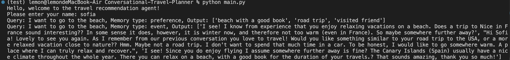

# Conversational-Travel-Planner

## Usage

1. Install the dependencies using 

    `pip install -r requirements.txt`

2. Install ollama (https://ollama.com/download) and have it running in the background

3. Download the LLM llama 3.2 (https://ollama.com/library/llama3.2) with the command 
   
   `ollama run llama3.2`

4. Run the main python file using 

    `python main.py`

5. Before we start, the system will print "Hello, welcome to the travel recommendation agent!" and ask for your name. For now, please type `sofia` since we only have the test data.

6. The first trial could be quite slow, as the models will be automatically downloaded. But after that every round should be quite quick.
    1. The input query now is hard-coded as "'I want to go to the beach'", but feel free to try different idea.
    2. Now we have the retrieved information and output, you should be able to check in the console, as exampled in the image below.

    

## Information Retrieval

TODO
